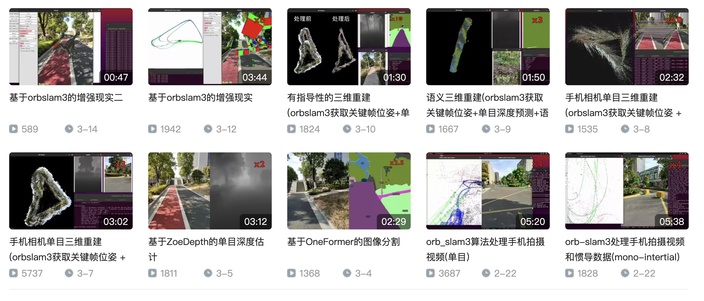

## 环境

* ubuntu20
* 小米9se

基于小米9se的单目imu，30fps + 300hz imu。通过本仓库提供的[安卓应用](https://github.com/lturing/ORB_SLAM3_modified/tree/main/android_app)获取图像和imu信息，并在ubuntu上处理成orb-slam3的数据格式和运行。流程如下图所示：

<div align=center></div>

## demo 
* [单目demo](https://www.bilibili.com/video/BV1is4y1b7RU)
* [单目inertial demo](https://www.bilibili.com/video/BV11M411J7jH)

<div align=center></div>

## **[安卓编译(通过安卓手机获取图像、加速度、角速度等信息)](./android_app)**

```
# 安装jdk，并添加环境变量
# https://www.oracle.com/java/technologies/downloads/#java11

# 安装gradle，并添加环境变量
# https://gradle.org/releases/

# 安装sdkmanger，并添加环境变量
# https://developer.android.com/studio/command-line/sdkmanager

# sdkmanager 命令测试
sdkmanager --list --sdk_root=/path/to/sdkmanager_root # list所有相关的包
sdkmanager "platforms;android-28" # 安装android-28(android sdk)
sdkmanager "ndk;21.0.6113669" # 安装ndk version=21.0.6113669

# 编译apk
cd $HOME
git clone https://github.com/lturing/ORB_SLAM3_modified.git
cd ORB_SLAM3_modified/android_app
./gradlew assembleDebug # 打包成apk

# 编译好的apk在目录 app/build/outputs/apk/debug
```

## imu噪声参数评估

安装本仓库提供的apk，将手机放在桌面上，保持静止状态，打开apk，录制3个小时以上的数据。录制好的数据在目录/Android/data/se.lth.math.videoimucapture/files下

### 处理数据

```
cd ~/ORB_SLAM3_modified
# 安装依赖包
unzip protoc-21.5-linux-x86_64.zip -d protoc-21.5
mkdir proto_python 
protoc-21.5/bin/protoc --python_out=proto_python android_app/protobuf/recording.proto
cp proto_python/protobuf/recording_pb2.py script 
pip3 install protobuf pyquaternion matplotlib numpy opencv_python py3rosmsgs PyYAML scipy   

# 将录制的数据(imu_data)复制到ubuntu系统中
data_dir=/path/to/imu_data

# 查看数据的统计信息
python script/data2statistics.py $data_dir/video_meta.pb3

# 将数据保存着rosbag，生成kalibr.bag、target.yaml、imu.yaml
python script/data2kalibr.py $data_dir --subsample 10 --save_image false
```

### 参数评估

```
# 安装kalibr
cd ~
git clone https://github.com/ethz-asl/kalibr.git
cd kalibr
docker build -t kalibr -f Dockerfile_ros1_20_04 . # change this to whatever ubuntu version you want

FOLDER=$HOME # path to your data on host
xhost +local:root
docker run -it -e "DISPLAY" -e "QT_X11_NO_MITSHM=1" \
    -v "/tmp/.X11-unix:/tmp/.X11-unix:rw" \
    -v "$FOLDER:/data" kalibr

# 在容器内运行
source devel/setup.bash

#退出容器，在ubuntu中的terminal中运行
cd $HOME
# 安装allan_variance_ros，评估imu的噪声参数
git clone https://github.com/ori-drs/allan_variance_ros.git

# 查看上一步创建的docker容器的id
docker ps -a 
docker start 容器id
docker attach 容器id
source devel/setup.bash

cd /data/allan_variance_ros
catkin build allan_variance_ros
source devel/setup.bash #激活allan_variance_ros的环境

# imu_data的数据
cd /data/path/to/imu_data 

# 进行参数评估，结果保存在/data/path/to/imu_data/allan_variance_ros
rosrun allan_variance_ros allan_variance /data/path/to/imu_data/kalibr.bag /data/path/to/imu_data/allan_variance_ros

# 生成imu.yaml，NoiseGyro、GyroWalk、NoiseAcc、AccWalk(连续)
rosrun allan_variance_ros analysis.py --data /data/path/to/imu_data/allan_variance_ros/allan_variance.csv

```

根据我们的经验，对于成本最低的传感器，可能需要将噪声模型参数增加10倍或更多[here](https://github.com/ethz-asl/kalibr/wiki/IMU-Noise-Model)

## 相机和imu内参矫正
```
# 查看上一步创建的docker容器的id
docker ps -a 
docker start 容器id
docker attach 容器id
source devel/setup.bash

# 生成Aprilgrid，用于矫正相机和imu内参

apt install python3
ln -sf /usr/bin/python3 /usr/bin/python
pip3 install pyx 
apt install texlive-binaries

# kalibr_create_target_pdf --type apriltag --nx [NUM_COLS] --ny [NUM_ROWS] --tsize [TAG_WIDTH_M] --tspace [TAG_SPACING_PERCENT]

# 刚好和mac 13寸屏幕一样大
rosrun kalibr kalibr_create_target_pdf --type apriltag --nx 6 --ny 4 --tsize 0.035 --tspace 0.2
```

打开target.pdf，并设置成实际大小展示。打开本仓库提供的apk，按照[视频教程](https://m.youtube.com/watch?v=puNXsnrYWTY)，录制视频和imu数据，数据保存在手机/Android/data/se.lth.math.videoimucapture/files目录下，将数据复制到ubuntu中

```
# 数据保存目录
data=/path/to/data
# 数据统计，确认角度和幅度
cd ~/ORB_SLAM3_modified
python script/data2statistics.py $data/video_meta.pb3 

# 处理成rosbag，便于kalibr处理
python script/data2kalibr.py $data --subsample 10 --save_image true

# 查看上一步创建的docker容器的id
docker ps -a 
docker start 容器id
docker attach 容器id
source devel/setup.bash

# 相机内参矫正，生成kalibr-camchain.yaml
cd $data_dir/kalibr
rosrun kalibr kalibr_calibrate_cameras --bag kalibr.bag --target target.yaml --models pinhole-radtan --topics /cam0/image_raw

#相机到imu参数矫正，生成kalibr-camchain-imucam.yaml
rosrun kalibr kalibr_calibrate_imu_camera --target target.yaml --imu imu.yaml --cams kalibr-camchain.yaml --bag kalibr.bag

```
将Examples/Monocular-Inertial/EuRoC.yaml相关参数用kalibr-camchain-imucam.yaml替代，并保存成mi_aprilgrid.yaml

## 录制视频和惯导
打开apk，录制视频和惯导，为了更好激活imu，录制开头需要注意移动的加速度、倾斜手机[here](https://github.com/UZ-SLAMLab/ORB_SLAM3/issues/435)。将录制好的手机上传到ubuntu系统中，并将数据处理成orb-slam需要的格式
```

cd ~/ORB_SLAM3_modified 
# 第一次
chmod +x ./build.sh 
./build.sh 

data=/path/to/data
python script/data2orbslam.py --data_dir $data

# 运行orb-slam mono
./Examples/Monocular/mono_mi ./Vocabulary/ORBvoc.txt ./Examples/Monocular-Inertial/mi_aprilgrid.yaml $data/data/

# 运行orb-slam mono inertial 
./Examples/Monocular-Inertial/mono_inertial_mi ./Vocabulary/ORBvoc.txt ./Examples/Monocular-Inertial/mi_aprilgrid.yaml $data/data/
```

## 代码修改
1. 增加rbg显示，根据配置文件中[isColor](https://github.com/lturing/ORB_SLAM3_modified/blob/main/Examples/Monocular-Inertial/mi_8_by_aprilgrid_1.yaml#L47)标志，决定rbg还是gray   
2. g2o中的[se3quat的exp](https://github.com/lturing/ORB_SLAM3_modified/blob/main/Thirdparty/g2o/g2o/types/se3quat.h#L223)有误，证明如下：   
```c++
R = (Matrix3d::Identity()
              + sin(theta)/theta *Omega
              + (1-cos(theta))/(theta*theta)*Omega2);

V = (Matrix3d::Identity()
  + (1-cos(theta))/(theta*theta)*Omega
  + (theta-sin(theta))/(pow(theta,3))*Omega2);
```    
当theta很小时(小于0.00001)，R和V可以简化为
```math
R = Matrix3d::Identity() + \frac{sin(\theta)}{\theta} *Omega + \frac{1-cos(\theta)}{\theta^2}*Omega2;
```
```math
cos(\theta)=1 - 2 * sin^2(\frac{\theta}{2}) \approx 1 - 2 * (\frac{\theta}{2})^2
```

```math
1 - cos(\theta) \approx \frac{\theta^2}{2}
```

```math
R \approx Matrix3d::Identity() + Omega + 0.5 * Omega2
```
同理
```math
V = Matrix3d::Identity() + \frac{1-cos(\theta)}{\theta^2} * Omega + \frac{\theta-sin(\theta)}{\theta^3} * Omega2
```
根据泰勒展开式
```math
sin(\theta) \approx \theta - \frac{\theta^3}{3!} + \frac{\theta^5}{5!}
```
故
```math
\frac{\theta-sin(\theta)}{\theta^3} \approx \frac{1.}{6}
```
故
```math
V \approx Matrix3d::Identity() + 0.5 * Omega + \frac{1.}{6} * Omega2
```
对于se3 $\delta$ 
```math
\delta = \begin{pmatrix} \theta \\ t \end{pmatrix}
```

又
```math 
e^\delta = \begin{pmatrix}
  R & Vt \\
  0 & 1 
  \end{pmatrix}
```
故当t很小时
```math
V \approx Matrix3d::Identity()
```

```math
R \approx Matrix3d::Identity() + Omega
```

3. 根据[EdgePriorAcc](https://github.com/lturing/ORB_SLAM3_modified/blob/main/include/G2oTypes.h#L778)对[G2oTypes中的jacobi](https://github.com/lturing/ORB_SLAM3_modified/blob/main/src/G2oTypes.cc#L765)进行修改

4. 根据[EdgePriorGyro](https://github.com/lturing/ORB_SLAM3_modified/blob/main/include/G2oTypes.h#L802)对[G2oTypes中的jacobi](https://github.com/lturing/ORB_SLAM3_modified/blob/main/src/G2oTypes.cc#L772)进行修改

## 代码中部分jacobi推导

[G2oTypes](https://github.com/lturing/ORB_SLAM3_modified/blob/main/src/G2oTypes.cc#L349)中的EdgeMono、EdgeMonoOnlyPose、EdgeStereo、EdgeStereoOnlyPose的jacobi推导
```math
t_{wb} = t_{wb} + R_{wb} * \delta t 
```

```math
R_{wb} = R_{wb} * Exp(\delta \theta) 
```

```math
err = obj - est 
```

```math
p_c = R_{cw} * p_w + t_{cw} 
```

```math
est = K(p_c) 
```

```math
K(
  \begin{pmatrix}
  x  \\
  y  \\
  z
  \end{pmatrix}) = 
\begin{pmatrix}
  \frac{f_x  x}{z} + c_x \\
  \frac{f_y  y}{z} + c_y 
  \end{pmatrix}
```

由于关于 $R_{wb}$ 和 $t_{wb}$ 的导数，需做以下变换
```math
R_{cw} = R_{cb} * R_{wb}^T 
```

```math
t_{cw} = R_{cb} * t_{bw} + t_{cb} 
```

```math
t_{bw} = -R_{wb}^T * t_{wb} 
```

因此
```math
est = K(R_{cw} * p_w + t_{cw}) = K(R_{cb} * R_{wb}^T * p_w - R_{cb} * R_{wb}^T * t_{wb} + t_{cb})
```

记
```math
p_c = R_{cb} * R_{wb}^T * p_w - R_{cb} * R_{wb}^T * t_{wb} + t_{cb} = R_{cb} * R_{wb}^T * (p_w - t_{wb}) + t_{cb}
```

error关于R的导数  
```math
\frac{\partial err}{\partial \delta \theta} = \frac{\partial err}{\partial p_c} \frac{\partial p_c}{\partial \delta \theta} 
```

```math
\frac{\partial err}{\partial p_c} =  \begin{pmatrix}
  \frac{f_x}{z} & 0 & -\frac{f_x x}{z^2}\\ 
  0 & \frac{f_y}{z} & -\frac{f_y y}{z^2}
  \end{pmatrix} 
```

```math
p_c(\delta \theta) = R_{cb} * (R_{wb} * Exp(\delta \theta))^T * (p_w - t_{wb}) + t_{cb} 
```

```math
= R_{cb} * (I - \delta \theta ^ \land)* R_{wb}^T * (p_w - t_{wb}) + t_{cb} 
```

```math
= p_c - R_{cb} * \delta \theta ^ \land * R_{wb}^T * (p_w - t_{wb}) 
```

```math
= p_c + R_{cb} * (R_{wb}^T * (p_w - t_{wb})) ^ \land *  \delta \theta 
```

所以
```math
\frac{\partial p_c}{\partial \delta \theta} = R_{cb} * (R_{wb}^T * (p_w - t_{wb})) ^ \land
```

```math
\frac{\partial p_c}{\partial \delta \theta} = R_{cb} * p_b ^ \land
```

同理
```math
p_c(\delta t) = R_{cb} * R_{wb}^T * (p_w - (t_{wb} + R_{wb} * \delta t)) + t_{cb} 
```

```math
= p_c - R_{cb} * R_{wb}^T * R_{wb} * \delta t  
```

```math
= p_c - R_{cb} * \delta t
```

所以
```math
\frac{\partial p_c}{\partial \delta t} = - R_{cb}
```

同理
```math
\frac{\partial p_c}{\partial \delta p_w} = R_{cb} * R_{wb}^T
```


## 参考

- [allan_variance_ros](https://github.com/ori-drs/allan_variance_ros)
- [kalibr以及其wiki](https://github.com/ethz-asl/kalibr)
- [VideoIMUCapture-Android](https://github.com/DavidGillsjo/VideoIMUCapture-Android)
- [ORB-SLAM3](https://github.com/UZ-SLAMLab/ORB_SLAM3)
- [VIO-Doc](https://github.com/StevenCui/VIO-Doc)
- [IMU-Preintegration-Propogation-Doc](https://github.com/PetWorm/IMU-Preintegration-Propogation-Doc)

# ORB-SLAM3

### V1.0, December 22th, 2021

**Authors:** Carlos Campos, Richard Elvira, Juan J. Gómez Rodríguez, [José M. M. Montiel](http://webdiis.unizar.es/~josemari/), [Juan D. Tardos](http://webdiis.unizar.es/~jdtardos/).

The [Changelog](https://github.com/UZ-SLAMLab/ORB_SLAM3/blob/master/Changelog.md) describes the features of each version.

ORB-SLAM3 is the first real-time SLAM library able to perform **Visual, Visual-Inertial and Multi-Map SLAM** with **monocular, stereo and RGB-D** cameras, using **pin-hole and fisheye** lens models. In all sensor configurations, ORB-SLAM3 is as robust as the best systems available in the literature, and significantly more accurate.

We provide examples to run ORB-SLAM3 in the [EuRoC dataset](http://projects.asl.ethz.ch/datasets/doku.php?id=kmavvisualinertialdatasets) using stereo or monocular, with or without IMU, and in the [TUM-VI dataset](https://vision.in.tum.de/data/datasets/visual-inertial-dataset) using fisheye stereo or monocular, with or without IMU. Videos of some example executions can be found at [ORB-SLAM3 channel](https://www.youtube.com/channel/UCXVt-kXG6T95Z4tVaYlU80Q).

This software is based on [ORB-SLAM2](https://github.com/raulmur/ORB_SLAM2) developed by [Raul Mur-Artal](http://webdiis.unizar.es/~raulmur/), [Juan D. Tardos](http://webdiis.unizar.es/~jdtardos/), [J. M. M. Montiel](http://webdiis.unizar.es/~josemari/) and [Dorian Galvez-Lopez](http://doriangalvez.com/) ([DBoW2](https://github.com/dorian3d/DBoW2)).

`<a href="https://youtu.be/HyLNq-98LRo" target="_blank">``</a>`

### Related Publications:

[ORB-SLAM3] Carlos Campos, Richard Elvira, Juan J. Gómez Rodríguez, José M. M. Montiel and Juan D. Tardós, **ORB-SLAM3: An Accurate Open-Source Library for Visual, Visual-Inertial and Multi-Map SLAM**, *IEEE Transactions on Robotics 37(6):1874-1890, Dec. 2021*. **[PDF](https://arxiv.org/abs/2007.11898)**.

[IMU-Initialization] Carlos Campos, J. M. M. Montiel and Juan D. Tardós, **Inertial-Only Optimization for Visual-Inertial Initialization**, *ICRA 2020*. **[PDF](https://arxiv.org/pdf/2003.05766.pdf)**

[ORBSLAM-Atlas] Richard Elvira, J. M. M. Montiel and Juan D. Tardós, **ORBSLAM-Atlas: a robust and accurate multi-map system**, *IROS 2019*. **[PDF](https://arxiv.org/pdf/1908.11585.pdf)**.

[ORBSLAM-VI] Raúl Mur-Artal, and Juan D. Tardós, **Visual-inertial monocular SLAM with map reuse**, IEEE Robotics and Automation Letters, vol. 2 no. 2, pp. 796-803, 2017. **[PDF](https://arxiv.org/pdf/1610.05949.pdf)**.

[Stereo and RGB-D] Raúl Mur-Artal and Juan D. Tardós. **ORB-SLAM2: an Open-Source SLAM System for Monocular, Stereo and RGB-D Cameras**. *IEEE Transactions on Robotics,* vol. 33, no. 5, pp. 1255-1262, 2017. **[PDF](https://arxiv.org/pdf/1610.06475.pdf)**.

[Monocular] Raúl Mur-Artal, José M. M. Montiel and Juan D. Tardós. **ORB-SLAM: A Versatile and Accurate Monocular SLAM System**. *IEEE Transactions on Robotics,* vol. 31, no. 5, pp. 1147-1163, 2015. (**2015 IEEE Transactions on Robotics Best Paper Award**). **[PDF](https://arxiv.org/pdf/1502.00956.pdf)**.

[DBoW2 Place Recognition] Dorian Gálvez-López and Juan D. Tardós. **Bags of Binary Words for Fast Place Recognition in Image Sequences**. *IEEE Transactions on Robotics,* vol. 28, no. 5, pp. 1188-1197, 2012. **[PDF](http://doriangalvez.com/php/dl.php?dlp=GalvezTRO12.pdf)**

# 1. License

ORB-SLAM3 is released under [GPLv3 license](https://github.com/UZ-SLAMLab/ORB_SLAM3/LICENSE). For a list of all code/library dependencies (and associated licenses), please see [Dependencies.md](https://github.com/UZ-SLAMLab/ORB_SLAM3/blob/master/Dependencies.md).

For a closed-source version of ORB-SLAM3 for commercial purposes, please contact the authors: orbslam (at) unizar (dot) es.

If you use ORB-SLAM3 in an academic work, please cite:

    @article{ORBSLAM3_TRO,
      title={{ORB-SLAM3}: An Accurate Open-Source Library for Visual, Visual-Inertial
               and Multi-Map {SLAM}},
      author={Campos, Carlos AND Elvira, Richard AND G\´omez, Juan J. AND Montiel,
              Jos\'e M. M. AND Tard\'os, Juan D.},
      journal={IEEE Transactions on Robotics},
      volume={37},
      number={6},
      pages={1874-1890},
      year={2021}
     }

# 2. Prerequisites

We have tested the library in **Ubuntu 16.04** and **18.04**, but it should be easy to compile in other platforms. A powerful computer (e.g. i7) will ensure real-time performance and provide more stable and accurate results.

## C++11 or C++0x Compiler

We use the new thread and chrono functionalities of C++11.

## Pangolin

We use [Pangolin](https://github.com/stevenlovegrove/Pangolin) for visualization and user interface. Dowload and install instructions can be found at: https://github.com/stevenlovegrove/Pangolin.

## OpenCV

We use [OpenCV](http://opencv.org) to manipulate images and features. Dowload and install instructions can be found at: http://opencv.org. **Required at leat 3.0. Tested with OpenCV 3.2.0 and 4.4.0**.

## Eigen3

Required by g2o (see below). Download and install instructions can be found at: http://eigen.tuxfamily.org. **Required at least 3.1.0**.

## DBoW2 and g2o (Included in Thirdparty folder)

We use modified versions of the [DBoW2](https://github.com/dorian3d/DBoW2) library to perform place recognition and [g2o](https://github.com/RainerKuemmerle/g2o) library to perform non-linear optimizations. Both modified libraries (which are BSD) are included in the *Thirdparty* folder.

## Python

Required to calculate the alignment of the trajectory with the ground truth. **Required Numpy module**.

* (win) http://www.python.org/downloads/windows
* (deb) `sudo apt install libpython2.7-dev`
* (mac) preinstalled with osx

## ROS (optional)

We provide some examples to process input of a monocular, monocular-inertial, stereo, stereo-inertial or RGB-D camera using ROS. Building these examples is optional. These have been tested with ROS Melodic under Ubuntu 18.04.

# 3. Building ORB-SLAM3 library and examples

Clone the repository:

```
git clone https://github.com/UZ-SLAMLab/ORB_SLAM3.git ORB_SLAM3
```

We provide a script `build.sh` to build the *Thirdparty* libraries and *ORB-SLAM3*. Please make sure you have installed all required dependencies (see section 2). Execute:

```
cd ORB_SLAM3
chmod +x build.sh
./build.sh
```

This will create **libORB_SLAM3.so**  at *lib* folder and the executables in *Examples* folder.

# 4. Running ORB-SLAM3 with your camera

Directory `Examples` contains several demo programs and calibration files to run ORB-SLAM3 in all sensor configurations with Intel Realsense cameras T265 and D435i. The steps needed to use your own camera are:

1. Calibrate your camera following `Calibration_Tutorial.pdf` and write your calibration file `your_camera.yaml`
2. Modify one of the provided demos to suit your specific camera model, and build it
3. Connect the camera to your computer using USB3 or the appropriate interface
4. Run ORB-SLAM3. For example, for our D435i camera, we would execute:

```
./Examples/Stereo-Inertial/stereo_inertial_realsense_D435i Vocabulary/ORBvoc.txt ./Examples/Stereo-Inertial/RealSense_D435i.yaml
```

# 5. EuRoC Examples

[EuRoC dataset](http://projects.asl.ethz.ch/datasets/doku.php?id=kmavvisualinertialdatasets) was recorded with two pinhole cameras and an inertial sensor. We provide an example script to launch EuRoC sequences in all the sensor configurations.

1. Download a sequence (ASL format) from http://projects.asl.ethz.ch/datasets/doku.php?id=kmavvisualinertialdatasets
2. Open the script "euroc_examples.sh" in the root of the project. Change **pathDatasetEuroc** variable to point to the directory where the dataset has been uncompressed.
3. Execute the following script to process all the sequences with all sensor configurations:

```
./euroc_examples
```

## Evaluation

EuRoC provides ground truth for each sequence in the IMU body reference. As pure visual executions report trajectories centered in the left camera, we provide in the "evaluation" folder the transformation of the ground truth to the left camera reference. Visual-inertial trajectories use the ground truth from the dataset.

Execute the following script to process sequences and compute the RMS ATE:

```
./euroc_eval_examples
```

# 6. TUM-VI Examples

[TUM-VI dataset](https://vision.in.tum.de/data/datasets/visual-inertial-dataset) was recorded with two fisheye cameras and an inertial sensor.

1. Download a sequence from https://vision.in.tum.de/data/datasets/visual-inertial-dataset and uncompress it.
2. Open the script "tum_vi_examples.sh" in the root of the project. Change **pathDatasetTUM_VI** variable to point to the directory where the dataset has been uncompressed.
3. Execute the following script to process all the sequences with all sensor configurations:

```
./tum_vi_examples
```

## Evaluation

In TUM-VI ground truth is only available in the room where all sequences start and end. As a result the error measures the drift at the end of the sequence.

Execute the following script to process sequences and compute the RMS ATE:

```
./tum_vi_eval_examples
```

# 7. ROS Examples

### Building the nodes for mono, mono-inertial, stereo, stereo-inertial and RGB-D

Tested with ROS Melodic and ubuntu 18.04.

1. Add the path including *Examples/ROS/ORB_SLAM3* to the ROS_PACKAGE_PATH environment variable. Open .bashrc file:

```
  gedit ~/.bashrc
```

and add at the end the following line. Replace PATH by the folder where you cloned ORB_SLAM3:

```
  export ROS_PACKAGE_PATH=${ROS_PACKAGE_PATH}:PATH/ORB_SLAM3/Examples/ROS
```

2. Execute `build_ros.sh` script:

```
  chmod +x build_ros.sh
  ./build_ros.sh
```

### Running Monocular Node

For a monocular input from topic `/camera/image_raw` run node ORB_SLAM3/Mono. You will need to provide the vocabulary file and a settings file. See the monocular examples above.

```
  rosrun ORB_SLAM3 Mono PATH_TO_VOCABULARY PATH_TO_SETTINGS_FILE
```

### Running Monocular-Inertial Node

For a monocular input from topic `/camera/image_raw` and an inertial input from topic `/imu`, run node ORB_SLAM3/Mono_Inertial. Setting the optional third argument to true will apply CLAHE equalization to images (Mainly for TUM-VI dataset).

```
  rosrun ORB_SLAM3 Mono PATH_TO_VOCABULARY PATH_TO_SETTINGS_FILE [EQUALIZATION]
```

### Running Stereo Node

For a stereo input from topic `/camera/left/image_raw` and `/camera/right/image_raw` run node ORB_SLAM3/Stereo. You will need to provide the vocabulary file and a settings file. For Pinhole camera model, if you **provide rectification matrices** (see Examples/Stereo/EuRoC.yaml example), the node will recitify the images online, **otherwise images must be pre-rectified**. For FishEye camera model, rectification is not required since system works with original images:

```
  rosrun ORB_SLAM3 Stereo PATH_TO_VOCABULARY PATH_TO_SETTINGS_FILE ONLINE_RECTIFICATION
```

### Running Stereo-Inertial Node

For a stereo input from topics `/camera/left/image_raw` and `/camera/right/image_raw`, and an inertial input from topic `/imu`, run node ORB_SLAM3/Stereo_Inertial. You will need to provide the vocabulary file and a settings file, including rectification matrices if required in a similar way to Stereo case:

```
  rosrun ORB_SLAM3 Stereo_Inertial PATH_TO_VOCABULARY PATH_TO_SETTINGS_FILE ONLINE_RECTIFICATION [EQUALIZATION]
```

### Running RGB_D Node

For an RGB-D input from topics `/camera/rgb/image_raw` and `/camera/depth_registered/image_raw`, run node ORB_SLAM3/RGBD. You will need to provide the vocabulary file and a settings file. See the RGB-D example above.

```
  rosrun ORB_SLAM3 RGBD PATH_TO_VOCABULARY PATH_TO_SETTINGS_FILE
```

**Running ROS example:** Download a rosbag (e.g. V1_02_medium.bag) from the EuRoC dataset (http://projects.asl.ethz.ch/datasets/doku.php?id=kmavvisualinertialdatasets). Open 3 tabs on the terminal and run the following command at each tab for a Stereo-Inertial configuration:

```
  roscore
```

```
  rosrun ORB_SLAM3 Stereo_Inertial Vocabulary/ORBvoc.txt Examples/Stereo-Inertial/EuRoC.yaml true
```

```
  rosbag play --pause V1_02_medium.bag /cam0/image_raw:=/camera/left/image_raw /cam1/image_raw:=/camera/right/image_raw /imu0:=/imu
```

Once ORB-SLAM3 has loaded the vocabulary, press space in the rosbag tab.

**Remark:** For rosbags from TUM-VI dataset, some play issue may appear due to chunk size. One possible solution is to rebag them with the default chunk size, for example:

```
  rosrun rosbag fastrebag.py dataset-room1_512_16.bag dataset-room1_512_16_small_chunks.bag
```

# 8. Running time analysis

A flag in `include\Config.h` activates time measurements. It is necessary to uncomment the line `#define REGISTER_TIMES` to obtain the time stats of one execution which is shown at the terminal and stored in a text file(`ExecTimeMean.txt`).

# 9. Calibration

You can find a tutorial for visual-inertial calibration and a detailed description of the contents of valid configuration files at  `Calibration_Tutorial.pdf`
