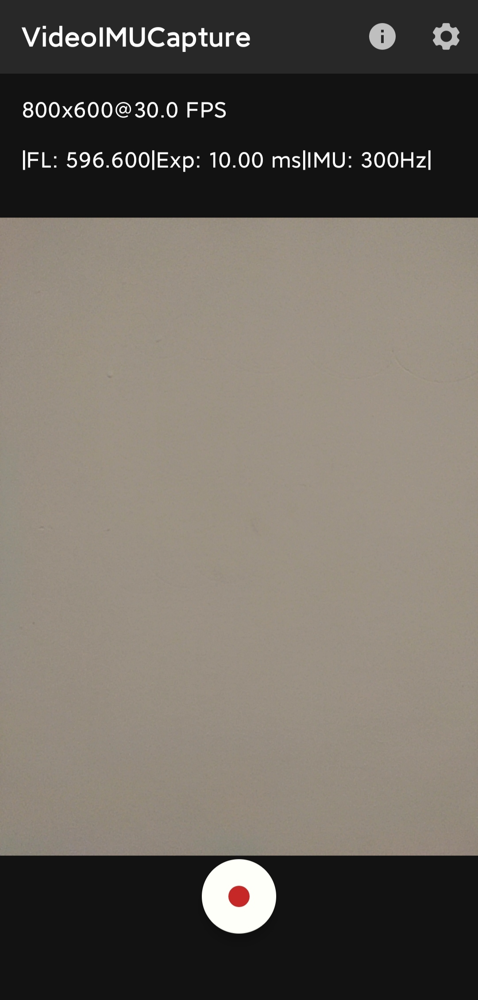
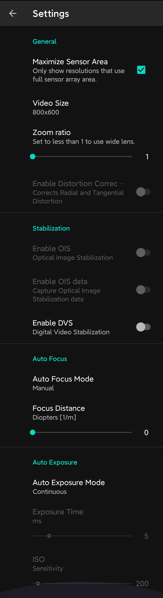

调用安卓手机上的摄像头和imu，获取图像、加速度、角加速度等信息

当前设置：分辨率800 * 600，帧率30hz，imu 300hz，固定焦距，动态曝光时间。可根据实际情况，修改以下代码  
* 分辨率 [DEFAULT_VIDEO_SIZE](https://github.com/lturing/ORB_SLAM3_modified/blob/main/android_app/app/src/main/java/se/lth/math/videoimucapture/CameraSettingsManager.java#L288)  
* 帧率 [mFrameRate](https://github.com/lturing/ORB_SLAM3_modified/blob/main/android_app/app/src/main/java/se/lth/math/videoimucapture/TextureMovieEncoder.java#L86)

* 固定焦距 [DEFAULT_FOCUS_MODE](https://github.com/lturing/ORB_SLAM3_modified/blob/main/android_app/app/src/main/java/se/lth/math/videoimucapture/CameraSettingsManager.java#L459)

* 动态曝光时间 [CameraSettingExposureMode](https://github.com/lturing/ORB_SLAM3_modified/blob/main/android_app/app/src/main/java/se/lth/math/videoimucapture/CameraSettingsManager.java#L572)

* imu rate [mSensorRate](https://github.com/lturing/ORB_SLAM3_modified/blob/main/android_app/app/src/main/java/se/lth/math/videoimucapture/IMUManager.java#L31)


## 编译成apk
```
./gradlew clean && ./gradlew assembleDebug

# 编译的apk 保存在 app/build/outputs/apk/debug
```

## app and settings 

<p float="left">
  
   
</p>


参考
[VideoIMUCapture-Android](https://github.com/DavidGillsjo/VideoIMUCapture-Android)
